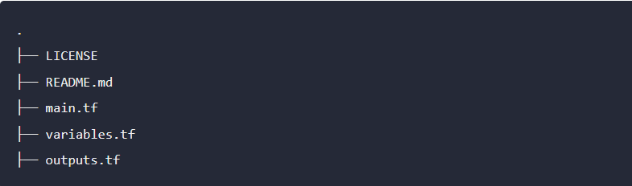

# What is Terraform 


* In simple terms, Terraform is a tool used in the field of infrastructure as code (IaC) to automate the process of managing and provisioning (setting up) infrastructure resources. These resources can include servers, databases, networks, and other components needed to run an application or system.

* Instead of manually configuring and setting up each component, Terraform allows you to define your infrastructure in a declarative configuration file. This file describes the desired state of your infrastructure, specifying what resources should exist, their configurations, and how they should be connected. 
  
* Terraform then takes care of translating this configuration into actions that create or update the actual infrastructure in cloud providers like AWS, Azure, or Google Cloud.

* In summary, Terraform helps automate the deployment and management of infrastructure, making it more efficient, repeatable, and scalable.


### Prerequisites
Ensure you have a cloud account 
- [Create Azure Cloud Account](https://azure.microsoft.com/en-in/free/)
  
Ensure you have the following prerequisites installed:
- [Terraform](https://www.terraform.io/downloads.html)
- [Provider CLI (e.g., Azure CLI, AWS CLI, Google Cloud SDK)](https://learn.microsoft.com/en-us/cli/azure/install-azure-cli-linux?pivots=apt)

  
## How Does Terraform Work

* Terraform creates and manages resources on cloud platforms and other services through their application programming interfaces (APIs). Providers enable Terraform to work with virtually any platform or service with an accessible API.


The core Terraform workflow consists of three stages:

* `Write:` You define resources, which may be across multiple cloud providers and services. For example, you might create a configuration to deploy an application on virtual machines in a Virtual Private Cloud (VPC) network with security groups and a load balancer.
  
* `Plan:` Terraform creates an execution plan describing the infrastructure it will create, update, or destroy based on the existing infrastructure and your configuration.
  
* `Apply:` On approval, Terraform performs the proposed operations in the correct order, respecting any resource dependencies. For example, if you update the properties of a VPC and change the number of virtual machines in that VPC, Terraform will recreate the VPC before scaling the virtual machines.


**While running the terraform template below are some common symbols you come across and the meaning of it is:**

* `+` create
* `-` destroy
* `-/+` replace (destroy and then create, or vice-versa if create-before-destroy is used)
* `~` update in-place
* `<=` read


### Let's create a basic terraform template for a virtual network.

```bash
# main.tf

provider "azurerm" {
  features = {}
}

resource "azurerm_resource_group" "example" {
  name     = "myResourceGroup"
  location = "East US"
}

resource "azurerm_virtual_network" "example" {
  name                = "myVNet"
  resource_group_name = azurerm_resource_group.example.name
  address_space       = ["10.0.0.0/16"]

  subnet {
    name           = "Subnet-1"
    address_prefix = "10.0.1.0/24"
  }
}
```
In this example:

* The azurerm_resource_group resource creates a Resource Group.
  
* The azurerm_virtual_network resource creates an Azure Virtual Network within that resource group.

* one subnet (Subnet-1) is defined within the virtual network, each with its own address prefix.

* Now, you can run the following commands:
  
  1. Initialize your Terraform configuration: `terraform init`
  2. Validate the configuration: `terraform validate`
  3. Apply the configuration to create the resources: `terraform apply` Terraform will prompt you to confirm the changes. Type yes to proceed.
  4. Remember to clean up your resources when you're done to avoid incurring charges: `terraform destroy`
    


# Terraform modules 

* A Terraform module is a set of Terraform configuration files in a single directory. Even a simple configuration consisting of a single directory with one or more `.tf` files is a module.

* When you run Terraform commands directly from such a directory, it is considered the root module. So in this sense, every Terraform configuration is part of a module. 


  
* A module that is called by another configuration is sometimes referred to as a "child module" of that configuration.
  
* You may have a simple set of Terraform configuration files such as:

  

# Why should we use Terraform Modules?

Using Terraform modules offers several advantages that can enhance the efficiency, maintainability, and scalability of your infrastructure as code (IaC) projects. Here are a few key points on why you should use Terraform modules:

1. `Reusability:` Modules allow you to encapsulate(bundling all data together) and package infrastructure components in a reusable and shareable way. You can create modules for common patterns, such as a web server, database, or network configuration, and reuse them across different projects.
   
2. `Maintainability:` Modular code is generally easier to understand and maintain. When a change is needed, you can make it in one place (the module) and have it reflected in all instances where the module is used.

3. `Isolation:` isolates the internal details of their implementation from the outside world. Users of a module don't need to know how it achieves its functionality; they only need to understand how to use it and what inputs it requires.


### Let us try to create a virtual-Network module for better understanding

* Create a new directory for your module, and inside that directory, create a file named main.tf,variables.tf,outputs.tf with the following content:
 ```bash
 # main.tf file

 resource "azurerm_virtual_network" "example" {
  name                = var.virtual_network_name
  resource_group_name = var.resource_group_name
  address_space       = var.address_space
}
 ```

```bash
#variables.tf

variable "resource_group_name" {
  type        = string
  description = "The name of the resource group in which to create the virtual network."
}

variable "virtual_network_name" {
  type        = string
  description = "The name of the virtual network."
}

variable "address_space" {
  type        = list(string)
  description = "List of address spaces to use for the virtual network."
}
```

```bash
#outputs.tf

output "virtual_network_id" {
  value = azurerm_virtual_network.example.id
}
```
* Now we will be using the root module to give the values instead of the child module.
```bash
#modules.tf

module "my_virtual_network" {
  source = "./my_virtual_network_module"  

  resource_group_name = "myResourceGroup"
  virtual_network_name = "myVirtualNetwork"
  address_space       = ["10.0.0.0/16"]
}
```
* Now we will execute `terraform init` and `terraform apply` It will create a virtual network.

# Count

count is a meta-argument defined by the Terraform language. It can be used with modules and with every resource type.

The count meta-argument accepts a whole number and creates that many instances of the resource or module. 

**How Count Works:**


* Each virtual network has a distinct infrastructure object associated with it, and each is separately created, updated, or destroyed when the configuration is applied.

```
resource "azurerm_virtual_network" "example" {
    count = 3

  name                = var.vnet_name[count.index]
  address_space       = ["10.0.0.0/16"]
  location            = azurerm_resource_group.example.location
  resource_group_name = azurerm_resource_group.example.name
}

# outputs

output "virtual_network_id" {
  value = azurerm_virtual_network.example[0].id
}

output "virtual_network_id" {
  value = azurerm_virtual_network.example[1].id
}

```

In blocks where the count is set, an additional count object is available in expressions, so you can modify the configuration of each instance. This object has one attribute:

`count.index` — The distinct index number (starting with 0) corresponding to this instance.

#### Referring to virtual network

When the count is set, Terraform distinguishes between the block itself and the multiple resource or module instances associated with it. virtual networks are identified by an index number, starting with 0.

`<TYPE>.<NAME>[<INDEX>]` or `module.<NAME>[<INDEX>]` (for example, azurerm_virtual_network.vnet[0], azurerm_virtual_network.vnet[1], etc.) refers to individual vnets.

### Our Voziq Terraform Template Structure Looks like:


### To Convert the above Voziq Terraform Template into Modules.

* We have to create each resource as a module.
* Always modules should be in the sub-directory or root module

  

In `Common-Module` we have all the resources that are used by both `Windows and Ubuntu modules`.

i.e Resource_Group,Virtual_Network,Subnets,Public_ip.

In `Ubuntu-VM-Module` and `Windows-VM-Module` we have resources that are required to create Virtual machines.

We have used the Count function in `Base-Module's` public_ip to control the creation, and set the variable as boolean, If we set the value to `true` in the variables file then it creates the `public_ip_adress`, if we set it to `false` then It will not create anything.

```bash
resource "azurerm_public_ip" "public_ip" {
   count = var.create_public_ip ? 1 : 0 # Set the value true in the variables file to create a resource.

  name                = var.public_ip_name
  resource_group_name = azurerm_resource_group.rg.name
  location            = var.resource_group_location
  allocation_method   = "Static"
}
```

```bash
#variables.tfvars

create_public_ip = false
```


We have used the count function in resource creation followed by length() `count = length(var.nic_names)`. So that it will create resources based on the network Interfaces created.

We have also used conditions in Nic of ubuntu-vm-module, so that It will create and attach `public_subnet,public_ip_address`. For now, we have commented on the condition, 

```bash
resource "azurerm_network_interface" "nic" {
  count = length(var.network_interface_names)

  name                = var.network_interface_names[count.index]
  resource_group_name = var.resource_group_name
  location            = var.resource_group_location

  ip_configuration {
    name                          = "internal"
    private_ip_address_allocation = "Static"
    private_ip_address            = var.nic_private_ip_addresses[count.index]
    subnet_id                     = var.private_subnet_id
    #count.index == 0 ? var.public_subnet_id : var.private_subnet_id
    # public_ip_address_id        = count.index == 0 ? var.public_ip_address_id : null
  }

}
```

whenever we require public_ip_id and public_subnet_id we will uncomment the condition and run the terraform module.


* After creating individual modules, now we can call them into the root module. 

* To call one module value into another module, we use outputs  

```bash
output "resource_group_name" {
  value = azurerm_resource_group.demo-rg.name
}

output "resource_group_location" {
  value = azurerm_resource_group.demo-rg.location

}

output "azurerm_resource_group_id" {
  value = azurerm_resource_group.demo-rg.id
}
```

Below We can see how modules are being called.


If we want to give the variable values in a file, we can give them in variables.tfvars of the root module


* Now execute `terraform init` to download the provider and modules. 
* Now execute `terraform validate`  to check the configuration is valid.
* Then `terraform plan` to get the data of what resources will be created.

* Once you feel that the following configuration matches your requirements, then hit `terraform apply -var-file="variables.tfvars"`

output: 

.png)

If we give the above module to other teams, they can change the values at a single location (variables.tfvars) and create the virtual machines.

In this way, it is easy to create infrastructure using terraform modules and is reusable.
